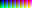

# RGBA8888 to RGB332
`rgba8888-to-rgb332` is a cli tool that will process all files found in an input folder, transforming them from a file format containing full 16 million color PNG files to 8-bit raw data files. This is accomplished using a restrictive palette. Transparent pixels can be replaced with a specified color.

## Purpose
The RGB332 raw file outputs are useful for developing software using embedded graphics, where an 8-bit color palette can reduce memory usage drastically and adhere to certain display requirements.

Color masking is an optional feature provided, granting a way to choose a pixel color to skip when blitting pixels to a buffer. For example, if the color 0b111_000_11 (hex #ff00ff or #ff00ffff with transparency channel) is chosen, it is simple during development to add that pixel color to a branch statement, and omit drawing it to the screen. This provides the user to implement their own transparency.

## Example Usage & Workflow
1. Review the RGB332 palette, your sprites MUST adhere to these colors strictly.
    1. If you wish to use transparency, you will need to decide on one of the colors from the palette to be reserved as the `MASK_COLOR`
    1. You may use fully transparent pixels, the RGBA8888 to RGB332 can perform the replacement
1. Create or export your sprites in PNG format, using RGBA 8888 format (standard 24/32 bit PNG)
1. Place all your sprites into a single folder
1. Execute `rgba8888-to-rgb332 -i <your_sprite_folder> -o <your_output_folder>`
    1. If your sprites used transparent pixels, you must use the `-m <mask_color>` argument
    1. The mask color must be represented by the format `0b00000000` or `0b000_000_00` for visual separation of the r_g_b channels
1. Raw .data files can be found in the output folder specified

## Palette
The palette used to map RGBA8888 to RGB332 follows strict rules.
For simplicity, it will be described using 8 character HEX color code rules.

### Red Channel
```
#00______ no red
#24______
#49______
#6d______
#92______
#b6______
#db______
#ff______ full red
```

### Green Channel
```
#__00____ no green
#__24____
#__49____
#__6d____
#__92____
#__b6____
#__db____
#__ff____ full green
```

### Blue Channel
```
#____00__ no blue
#____55__
#____aa__
#____ff__ full blue
```

### Alpha Channel
```
#______00 a fully transparent pixel
#______ff a fully opaque pixel
```
_Note: When the alpha channel is 00, the first 3 bytes of the pixel are ignored._

## Palette Reference


